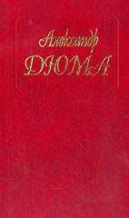

  
[Белые и синие](Белые%20и%20синие)

  
[Волонтер девяносто второго года](Волонтер%20девяносто%20второго%20года)

  
[Граф Монте-Кристо](Граф%20Монте-Кристо)

  
[Графиня де Монсоро. Том 1](Графиня%20де%20Монсоро.%20Том%201)

  
[Графиня де Монсоро. Том 2](Графиня%20де%20Монсоро.%20Том%202)

  
[Графиня де Шарни. Том 1](Графиня%20де%20Шарни.%20Том%201)

  
[Двадцать лет спустя](Двадцать%20лет%20спустя)

  
[Две Дианы](Две%20Дианы)

  
[Дочь регента](Дочь%20регента)

  
[Женская война](Женская%20война)

  
[Инженю](Инженю)

  
[Королева Марго](Королева%20Марго)

  
[Любовное приключение](Любовное%20приключение)

  
[Мадам Лафарг](Мадам%20Лафарг)

  
[Мадам де Шамбле](Мадам%20де%20Шамбле)

  
[Олимпия Клевская](Олимпия%20Клевская)

  
[Паж герцога Савойского](Паж%20герцога%20Савойского)

  
[Прусский террор](Прусский%20террор)

  
[Робин Гуд](Робин%20Гуд)

  
[Роман о Виолетте](Роман%20о%20Виолетте)

  
[Сан-Феличе. Книга вторая](Сан-Феличе.%20Книга%20вторая)

  
[Сан-Феличе. Книга первая](Сан-Феличе.%20Книга%20первая)

  
[Сильвандир](Сильвандир)

  
[Соратники Иегу](Соратники%20Иегу)

  
[Сорок пять](Сорок%20пять)

.jpg)  
[Три мушкетера (с иллюстрациями)](Три%20мушкетера%20(с%20иллюстрациями))

  
[Шевалье д'Арманталь](Шевалье%20д'Арманталь)
