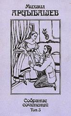

  
[Братья Аримафейские](Братья%20Аримафейские)

  
[Деревянный чурбан](Деревянный%20чурбан)

  
[Женщина, стоящая посреди](Женщина,%20стоящая%20посреди)

  
[Записки писателя](Записки%20писателя)

  
[Злодеи](Злодеи)

  
[Из дневника одного покойника](Из%20дневника%20одного%20покойника)

  
[Из подвала](Из%20подвала)

  
[Кровавое пятно](Кровавое%20пятно)

  
[Куприян](Куприян)

  
[Миллионы](Миллионы)

  
[Мститель](Мститель)

  
[О ревности](О%20ревности)

  
[Палата неизлечимых](Палата%20неизлечимых)

  
[Паша Туманов](Паша%20Туманов)

  
[Под солнцем](Под%20солнцем)

  
[Подпрапорщик Гололобов](Подпрапорщик%20Гололобов)

  
[Преступление доктора Лурье](Преступление%20доктора%20Лурье)

  
[Пропасть](Пропасть)

  
[Рабочий Шевырев](Рабочий%20Шевырев)

  
[Рассказ о великом знании](Рассказ%20о%20великом%20знании)

  
[Рассказ об одной пощечине](Рассказ%20об%20одной%20пощечине)

  
[Революционер](Революционер)

  
[Роман маленькой женщины](Роман%20маленькой%20женщины)

  
[Сказка старого прокурора](Сказка%20старого%20прокурора)

  
[Смерть Ланде](Смерть%20Ланде)

  
[Смех](Смех)

  
[Старая история](Старая%20история)

  
[У последней черты](У%20последней%20черты)

  
[Человеческая волна](Человеческая%20волна)
