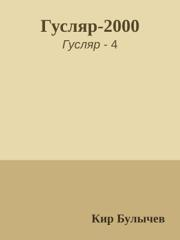
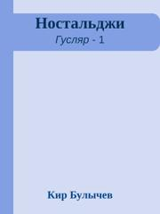
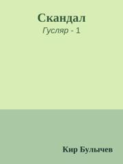
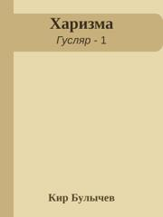
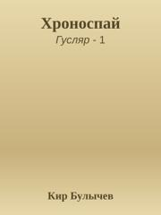

  
[«Твоя Рашель...»](«Твоя%20Рашель...»)

  
[Вас много – я одна](Вас%20много%20–%20я%20одна)

.jpg)  
[Гений из Гусляра (Рассказ)](Гений%20из%20Гусляра%20(Рассказ))

.jpg)  
[Гений из Гусляра (Сборник)](Гений%20из%20Гусляра%20(Сборник))

  
[Главная тайна Толстого](Главная%20тайна%20Толстого)

  
[Голова на гренадине](Голова%20на%20гренадине)

  
[Горилла в бронежилете](Горилла%20в%20бронежилете)

  
[Господа гуслярцы](Господа%20гуслярцы)

  
[Гусляр навеки](Гусляр%20навеки)

  
[Гусляр-2000](Гусляр-2000)

.jpg)  
[Жертва вторжения (Рассказ)](Жертва%20вторжения%20(Рассказ))

  
[Золотые рыбки снова в продаже](Золотые%20рыбки%20снова%20в%20продаже)

  
[Из огня да в полымя](Из%20огня%20да%20в%20полымя)

  
[Инструмент для вундеркинда](Инструмент%20для%20вундеркинда)

  
[Космография ревности](Космография%20ревности)

  
[Ксения без головы](Ксения%20без%20головы)

  
[Лекарство от всего](Лекарство%20от%20всего)

  
[Ностальджи](Ностальджи)

  
[Письма Ложкина](Письма%20Ложкина)

  
[Роковая свадьба](Роковая%20свадьба)

  
[Скандал](Скандал)

  
[Туфли из кожи игуанодона](Туфли%20из%20кожи%20игуанодона)

  
[Харизма](Харизма)

  
[Хроноспай](Хроноспай)

  
[Шестьдесят вторая серия](Шестьдесят%20вторая%20серия)

  
[Шпионский бумеранг](Шпионский%20бумеранг)
